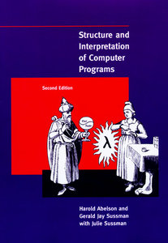

# خودتون علوم کامپیوتر را یاد بگیرید.

>This document is a persian (farsi) translation of TeachYourselfCS, written by [Ozan Onay](https://twitter.com/oznova_) and [Myles Byrne](https://twitter.com/quackingduck). For more information about this translation, please refer to [the end of this document](#translator).

>برای اطلاعات بیشتر در مورد ترجمه به [پایین فایل](#translator) مراجعه کنید.

نکته: این راهنما اردیبهشت ۱۳۹۹ دوباره نوشته شد. برای نسخه قبلی(سال 2016) [اینجا](https://teachyourselfcs.com/2016/) کلیک کنید.

اگر شما یک مهندس نرم افزار خود اموز یا با مدرک دوره های بوت کمپ هستید، یادگرفتن علوم کامپیوتر را به خودتون مدیونید. خوشبختانه، میتونین یه مدرک علوم کامپیوتر معتبر جهانی بدون سال ها درس خوندن و با خرج کمی داشته باشید  :money_with_wings:.

یه عالمه منابع مختلف وجود دارن ولی بعضی هاشون از بقیه بهتر هستن. شما نیازی به یه لیست دویست تایی از پکیج های آموزشی ندارید. فقط کافیه که به این سوالات جواب بدید:

-   شما باید **چه چیز هایی** رو یاد بگیرید و چرا؟
-   **بهترین کتاب یا دوره ویدئویی** برای هر کدام از آن موضوع ها چیست؟

## توضیح طولانی

همه ۹ موضوع زیر را به ترتیب جدولی که آورده شده یاد بگیرید، از یکی از کتاب یا ویدئوهای اورده شده میتوانید استفاده کنید، ولی بهتر هست هر دو را دنبال کنید. برای هر موضوع، ۱۰۰ تا ۲۰۰ ساعت وقت برای یادگیری بزارید و دوباره به 
علاقه و شغلی که میخواید انتخاب کنید، فکر کنید :rocket:. 

|موضوع|دلیل یادگیری|کتاب|ویدئو|
|------:|---------:|:---|:-----|
|**[برنامه نویسی](#programming)**|اون آدمی نباشید که مطالب را "کامل درک نمی کرد".|*Structure and Interpretation of Computer Programs* |Brian Harvey’s Berkeley CS 61A|
|**[معماری کامپیوتر](#architecture)**|اگه ذهنیت درست و محکمی درمورد اینکه یک کامپیوتر چگونه کار میکند نداشته باشید، همه کار های سطح بالاتر شکننده خواهند بود.|*Computer Systems: A Programmer's Perspective*|Berkeley CS 61C|
|**[الگوریتم و ساختمان داده](#algorithms)**|اگه ندانید که چجوری از ساختارهایی مثل استک، درخت، صف و گراف استفاده کنید، مشکلات چالشی غیرقابل حل خواهند بود.|*The Algorithm Design Manual*|Steven Skiena’s lectures|
|**[ریاضی برای علوم کامپیوتر](#math)**| علوم کامپیوتر در واقع یک شاخه از ریاضیات است، پس یادگیری ریاضی برای شما یک مزیت مهم محسوب میشود. |*Mathematics for Computer Science*|Tom Leighton’s MIT 6.042J|
|**[سیستم عامل ها](#operating-systems)**|اکثر کد هایی که شما مینویسید توسط سیستم عامل اجرا میشوند، پس شما باید بدانید انها چگونه باهم ارتباط برقرار میکنند|*operating systems : Three Easy Pieces*|Berkeley CS 162|
|**[شبکه های کامپیوتری](#networking)**|معلوم شد که اینترنت نقش بزرگی بازی میکنه: درک کنید چگونه کار میکند تا از پتانسیل های آن بهره ببرید.|*Computer Networking: A Top-Down Approach*|Stanford CS 144|
|**[پایگاه های داده](#databases)**|داده در قلب مهم ترین برنامه ها قرار دارند، اما تعداد کمی درک میکنند که پایگاه داده ها در واقع چگونه کار میکنند.|*Readings in Database Systems*|Joe Hellerstein’s Berkeley CS 186|
|**[زبان ها و کامپایلر](#languages)**|اگر شما درک کنید که زبان ها و کامپایلر در واقع چطور کار میکنند، شما کد های بهتری مینویسید و زبان های جدید را ساده تر یاد میگیرید.|*Crafting Interpreters*|Alex Aiken’s course on edX|
|**[سیستم های توزیع شده](#distributed-systems)**|امروزه اکثر سیستم ها، سیستم های توزیع شده اند.|*Designing Data-Intensive Applications* by Martin Kleppmann|MIT 6.824|

## هنوز خیلی زیاده ؟

 اگر ایده یادگیری 9 موضوع در طی چند سال طاقت فرسا است، ما پیشنهاد میکینم فقط روی دو تا کتاب تمرکز کنید: *Computer Systems: A Programmer's Perspective* و *Designing Data-Intensive Applications*. بر اساس تجربه ما، این دو کتاب بازده بسیار بالایی با صرف وقت کم دارد، مخصوصا برای مهندسان خودآموز و شرکت کنندگان در دوره های بوت کمپی که روی یک برنامه شبکه ای کار میکنند. انها همچنین میتوانند به عنوان دروازه ی ورودی به سر فصل های بالا باشند.

## چرا علوم کامپیوتر یاد بگیریم؟

دو دسته مهندس نرم افزار وجود دارد: آنهایی که علوم کامپیوتر را آنقدر خوب درک میکنند که کار های چالشی و خلاقانه انجام دهند ,و آنهایی که مهندس نرم افزارند چون با چند ابزار سطح بالا آشنایی دارند. 

هر دو دسته خود را مهندس نرم افزار میدانند و هردو تمایل دارند در ابتدای کارشان حقوق یک اندازه دریافت کنند. ولی مهندسان دسته اول در طی زمان در پروژه های با در امد بالاتر و رضایت بخش تری استخدام میشوند، خواه این کار ارزش تجاری داشته باشد یا همکاری در یک پروژه اوپن سورس باشد، رهبری فنی یا مشارکت فردی سطح بالا در پروژه باشد.

مهندسان دسته اول علوم کامپیوتر را عمیق یاد گرفته اند، چه از طرق یادگیری به شکل متعارف و چه از طریق یادگیری پیوسته در طی حرفه ی خود. مهندسان دسته دوم معمولا در سطح باقی میمانند و در یادگیری عمیق نمیشوند، به جای یادگیری پایه های اساسی یک مبحث به یادگیری ابزار و تکنولوژی های آن میپردازند، و فقط زمانی یک مهارت جدید یاد میگیرند که باد تکنوژی ها نو از آن سمت شروع به وزیدن کند.
در حال حاضر، تعداد افرادی که وارد این صنعت میشوند در حال رشد چشمگیری است، در حالی که تعداد فارغ التحصیلان رشته علوم کامپیوتر تقریبا ثابت است. این تعداد زیاد مهندسان نوع 2 فرصت های شغلی آنها را کاهش داده و آنها را از داشتن شغل رضایت بخش در صنعت کامپیوتر باز میدارد. چه شما بخواهید از مهندسان نرم افزار نوع یک باشید یا به دنبال امنیت شغلی هستید، یادگیری علوم کامپیوتر تنها راه قابل اعتماد است.

## راهنما برای هر موضوع

### برنامه نویسی
اکثر برنامه های علوم کامپیوتر در مقطع کارشناسی با یک "مقدمه" بر برنامه نویسی کامپیوتر آغاز میشوند. نسخه های خوب این دوره ها نه تنها نیاز های تازه کاران در این زمینه را فراهم میکند، بلکه برای آنهایی که در ابتدای یادگیری شان مفاهیم و مدل های برنامه نویسی را یاد نگرفته اند هم مفید است.

پیشنهاد استاندارد ما برای یادگیری برنامه نویسی کامپیوتر کلاسیک است، کتاب *Structure and Interpretation of Computer Programs*، که به صورت رایگان و آنلاین، هم به عنوان [کتاب](https://mitpress.mit.edu/sites/default/files/sicp/full-text/book/book.html)، و هم در قالب مجموعه [ویدیو های سخنرانی MIT](http://ocw.mit.edu/courses/electrical-engineering-and-computer-science/6-001-structure-and-interpretation-of-computer-programs-spring-2005/video-lectures/) در دسترس است. با اینکه ویدیو های دانشگاه MIT  خیلی خوب هستند، پیشنهاد ما برای دوره های ویدیو ای در واقع [سخنرانی های SICP  برایان هاروی ](https://archive.org/details/ucberkeley-webcast-PL3E89002AA9B9879E?sort=titleSorter) است. این ویدیو ها بیشتر از سخنرانی های MIT دانش آموزان جدید را هدف گرفته است.

ما پیشنهاد میکنیم سه فصل اول کتاب "SICP" را بخوانید و تمارین ان را انجام دهید. برای تمرینات اضافه تر، مشکلات و مسائل کوچک برنامه نویسی مانند نمونه های در سایت [exercism](http://exercism.io/) را حل کنید.

اولین بار که این راهنما در سال 2016 منتشر شد، یکی از سوالاتی که به طور متداول از ما پرسیده شد این بود که آیا ما دوره های 61A که دوباره توسط جان دنیرو تدریس شده است یا کتاب مربوطه یعنی *[Composing Programs](https://composingprograms.com/)*، که یکی از کتاب های یادگیری SICP به طور سنتی است اما از زبان پایتون استفاده میکند را پیشنهاد میکنیم یا نه. به نظر ما منابع دنیرو هم خوب هستند و ممکن است خیلی از دانش آموزان آن را ترجیح دهند، اما ما همچنان سخنرانی های SICP، Scheme، و برایان هاروی را به عنوان اولین منابعی که باید امتحان کنید پیشنهاد میکنیم.

Why? Because SICP is unique in its ability—at least potentially—to alter your fundamental beliefs about computers and programming. Not everybody will experience this. Some will hate the book, others won't get past the first few pages. But the potential reward makes it worth trying.

If you don't enjoy SICP, try *Composing Programs*. If that still doesn't suit, try *[How to Design Programs](http://www.htdp.org/)*. If none of these seem to be rewarding your effort, perhaps that's a sign that you should focus on other topics for some time, and revisit the discipline of programming in another year or two.

Finally, a point of clarification: this guide is NOT designed for those who are entirely new to programming. We assume that you are a competent programmer without a background in computer science, looking to fill in some knowledge gaps. The fact that we've included a section on "programming" is simply a reminder that there may be more to learn. For those who've never coded before, but who'd like to, you might prefer a guide like [this one](https://www.reddit.com/r/learnprogramming/wiki/faq#wiki_getting_started).

### معماری کامپیوتر

Computer Architecture—sometimes called “computer systems” or “computer organization”—is an important first look at computing below the surface of software. In our experience, it’s the most neglected area among self-taught software engineers.

Our favorite introductory book is *[Computer Systems: A Programmer's Perspective](http://csapp.cs.cmu.edu/3e/home.html)*, and a typical introductory computer architecture course using the book [would cover](http://csapp.cs.cmu.edu/3e/courses.html) most of chapters 1-6.

We love CS:APP for the practical, programmer-oriented approach. While there's much more to computer architecture than what's covered in the book, it serves as a great starting point for those who'd like to understand computer systems primarily in order to write faster, more efficient and more reliable *software*.

For those who'd prefer both a gentler introduction to the topic and a balance of hardware and software concerns, we suggest *The Elements of Computing Systems*, also known as “Nand2Tetris”. This is an ambitious book attempting to give you a cohesive understanding of how everything in a computer works. Each chapter involves building a small piece of the overall system, from writing elementary logic gates in HDL, through a CPU and assembler, all the way to an application the size of a Tetris game.

We recommend reading through the first six chapters of the book and completing the associated projects. This will develop your understanding of the relationship between the architecture of the machine and the software that runs on it.

The first half of the book (and all of its projects), are available for free from [the Nand2Tetris website](http://www.nand2tetris.org/). It’s also available as [a Coursera course with accompanying videos](https://www.coursera.org/learn/build-a-computer).

In seeking simplicity and cohesiveness, Nand2Tetris trades off depth. In particular, two very important concepts in modern computer architectures are pipelining and memory hierarchy, but both are mostly absent from the text.

Once you feel comfortable with the content of Nand2Tetris, we suggest either returning to CS:APP, or considering Patterson and Hennessy’s *[Computer Organization and Design](https://smile.amazon.com/Computer-Organization-Design-Fifth-Architecture/dp/0124077269)*, an excellent and now classic text. Not every section in the book is essential; we suggest following Berkeley’s [CS61C course](http://inst.eecs.berkeley.edu/~cs61c/sp15/) “Great Ideas in Computer Architecture” for specific readings. The lecture notes and labs are available online, and past lectures are [on the Internet Archive](https://archive.org/details/ucberkeley-webcast-PL-XXv-cvA_iCl2-D-FS5mk0jFF6cYSJs_).

> Hardware is the platform

– Mike Acton, Engine Director at Insomniac Games
([watch his CppCon talk](https://www.youtube.com/watch?v=rX0ItVEVjHc))

### الگوریتم و ساختار داده

We agree with decades of common wisdom that familiarity with common algorithms and data structures is one of the most empowering aspects of a computer science education. This is also a great place to train one’s general problem-solving abilities, which will pay off in every other area of study.

There are hundreds of books available, but our favorite is *[The Algorithm Design Manual](https://smile.amazon.com/Algorithm-Design-Manual-Steven-Skiena/dp/1848000693/)* by Steven Skiena. He clearly loves algorithmic problem solving and typically succeeds in fostering similar enthusiasm among his students and readers. In our opinion, the two more commonly suggested texts (CLRS and Sedgewick) tend to be a little too proof-heavy for those learning the material primarily to help with practical problem solving.

For those who prefer video lectures, [Skiena generously provides his online](https://www.youtube.com/watch?v=A2bFN3MyNDA&list=PLOtl7M3yp-DX32N0fVIyvn7ipWKNGmwpp). We also really like Tim Roughgarden’s course, available [on Coursera](https://www.coursera.org/specializations/algorithms) and [elsewhere](http://timroughgarden.org/videos.html). Whether you prefer Skiena’s or Roughgarden’s lecture style will be a matter of personal preference. In fact, there are dozens of good alternatives, so if you happen to find another that you like, we encourage you to stick with it!

For practice, our preferred approach is for students to solve problems on [Leetcode](https://leetcode.com/). These tend to be interesting problems with decent accompanying solutions and discussions. They also help you test progress against questions that are commonly used in technical interviews at the more competitive software companies. We suggest solving around 100 random leetcode problems as part of your studies.

Finally, we strongly recommend *[How to Solve It](https://smile.amazon.com/How-Solve-Mathematical-Princeton-Science/dp/069116407X/)* as an excellent and unique guide to general problem solving; it’s as applicable to computer science as it is to mathematics.

> I have only one method that I recommend extensively—it’s called think before you write.

— Richard Hamming

### ریاضی برای علوم کامپیوتر

In some ways, computer science is an overgrown branch of applied mathematics. While many software engineers try—and to varying degrees succeed—at ignoring this, we encourage you to embrace it with direct study. Doing so successfully will give you an enormous competitive advantage over those who don’t.

The most relevant area of math for CS is broadly called “discrete mathematics”, where “discrete” is the opposite of “continuous” and is loosely a collection of interesting applied math topics outside of calculus. Given the vague definition, it’s not meaningful to try to cover the entire breadth of “discrete mathematics”. A more realistic goal is to build a working understanding of logic, combinatorics and probability, set theory, graph theory, and a little of the number theory informing cryptography. Linear algebra is an additional worthwhile area of study, given its importance in computer graphics and machine learning.

Our suggested starting point for discrete mathematics is the set of [lecture notes by László Lovász](http://www.cs.elte.hu/~lovasz/dmbook.ps). Professor Lovász did a good job of making the content approachable and intuitive, so this serves as a better starting point than more formal texts.

For a more advanced treatment, we suggest *[Mathematics for Computer Science](https://courses.csail.mit.edu/6.042/spring17/mcs.pdf)*, the book-length lecture notes for the MIT course of the same name. That course’s video lectures are also [freely available](https://ocw.mit.edu/courses/electrical-engineering-and-computer-science/6-042j-mathematics-for-computer-science-fall-2010/video-lectures/), and are our recommended video lectures for discrete math.

For linear algebra, we suggest starting with the [Essence of linear algebra](https://www.youtube.com/playlist?list=PLZHQObOWTQDPD3MizzM2xVFitgF8hE_ab) video series, followed by Gilbert Strang’s [book](https://www.amazon.com/Introduction-Linear-Algebra-Gilbert-Strang/dp/0980232775/) and [video lectures](https://ocw.mit.edu/courses/mathematics/18-06-linear-algebra-spring-2010/video-lectures/).

> If people do not believe that mathematics is simple, it is only because they do not realize how complicated life is.

— John von Neumann

### سیستم های عامل

*[Operating System Concepts](https://www.amazon.com/dp/1118063333/)* (the “Dinosaur book”) and *[Modern Operating Systems](https://www.amazon.com/dp/013359162X/)* are the “classic” books on operating systems. Both have attracted criticism for their lack of clarity and general student unfriendliness.

*Operating Systems: Three Easy Pieces* is a good alternative that’s [freely available online](http://pages.cs.wisc.edu/~remzi/OSTEP/). We particularly like the structure and readability of the book, and feel that the exercises are worthwhile.

After OSTEP, we encourage you to explore the design decisions of specific operating systems, through “{OS name} Internals” style books such as *[Lion's commentary on Unix](https://www.amazon.com/Lions-Commentary-Unix-John/dp/1573980137/)*, *[The Design and Implementation of the FreeBSD Operating System](https://www.amazon.com/Design-Implementation-FreeBSD-Operating-System/dp/0321968972/)*, and *[Mac OS X Internals](https://www.amazon.com/Mac-OS-Internals-Systems-Approach/dp/0321278542/)*. For Linux, we suggest Robert Love's fantastic [Linux Kernel Development](https://www.amazon.com/Linux-Kernel-Development-Robert-Love/dp/0672329468).

A great way to consolidate your understanding of operating systems is to read the code of a small kernel and add features. One choice is [xv6](https://pdos.csail.mit.edu/6.828/2016/xv6.html), a port of Unix V6 to ANSI C and x86, maintained for a course at MIT. OSTEP has an appendix of potential [xv6 labs](http://pages.cs.wisc.edu/~remzi/OSTEP/lab-projects-xv6.pdf) full of great ideas for potential projects.

### شبکه های کامپیوتری

Given that so much of software engineering is on web servers and clients, one of the most immediately valuable areas of computer science is computer networking. Our self-taught students who methodically study networking find that they finally understand terms, concepts and protocols they’d been surrounded by for years.

Our favorite book on the topic is *[Computer Networking: A Top-Down Approach](https://smile.amazon.com/Computer-Networking-Top-Down-Approach-7th/dp/0133594149/)*. The small projects and exercises in the book are well worth doing, and we particularly like the “Wireshark labs”, which they have [generously provided online](http://www-net.cs.umass.edu/wireshark-labs/).

For those who prefer video lectures, we suggest Stanford’s [*Introduction to Computer Networking course*](https://www.youtube.com/playlist?list=PLvFG2xYBrYAQCyz4Wx3NPoYJOFjvU7g2Z) previously available via Stanford's MOOC platform Lagunita, but sadly now only available as unofficial playlists on Youtube.

> You can’t gaze in the crystal ball and see the future. What the Internet is going to be in the future is what society makes it.

— Bob Kahn

### پایگاه داده

It takes more work to self-learn about database systems than it does with most other topics. It’s a relatively new (i.e. post 1970s) field of study with strong commercial incentives for ideas to stay behind closed doors. Additionally, many potentially excellent textbook authors have preferred to join or start companies instead.

Given the circumstances, we encourage self-learners to generally avoid textbooks and start with [recordings of CS 186](https://www.youtube.com/user/CS186Berkeley/videos), Joe Hellerstein’s databases course at Berkeley, and to progress to reading papers after.

One paper particularly worth mentioning for new students is “[Architecture of a Database System](http://db.cs.berkeley.edu/papers/fntdb07-architecture.pdf)”, which uniquely provides a high-level view of how relational database management systems (RDBMS) work. This will serve as a useful skeleton for further study.

*Readings in Database Systems*, better known as [the databases “Red Book”](http://www.redbook.io/), is a collection of papers compiled and edited by Peter Bailis, Joe Hellerstein and Michael Stonebraker. For those who have progressed beyond the level of the CS 186 content, the Red Book should be your next stop.

If you're adamant about using an introductory textbook, we suggest *[Database Management Systems](https://smile.amazon.com/Database-Management-Systems-Raghu-Ramakrishnan/dp/0072465638/)* by Ramakrishnan and Gehrke. For more advanced students, Jim Gray’s classic *[Transaction Processing: Concepts and Techniques](https://www.amazon.com/Transaction-Processing-Concepts-Techniques-Management/dp/1558601902)* is worthwhile, but we don’t encourage using this as a first resource.

Finally, data modeling is a neglected and poorly taught aspect of working with databases. Our suggested book on the topic is *[Data and Reality: A Timeless Perspective on Perceiving and Managing Information in Our Imprecise World](https://www.amazon.com/Data-Reality-Perspective-Perceiving-Information/dp/1935504215)*.

### زبان ها و کامپایلر ها

Most programmers learn languages, whereas most computer scientists learn *about* languages. This gives the computer scientist a distinct advantage over the programmer, even in the domain of programming! Their knowledge generalizes; they are able to understand the operation of a new language more deeply and quickly than those who have merely learned specific languages.

Our suggested introductory text is the excellent *[Crafting Interpreters](https://craftinginterpreters.com/contents.html)* by Bob Nystrom, available for free online. It's well organized, highly entertaining, and well suited to those whose primary goal is simply to better understand their languages and language tools. We suggest taking the time to work through the whole thing, attempting whichever of the "challenges" sustain your interest.

A more traditional recommendation is *[Compilers: Principles, Techniques & Tools](https://smile.amazon.com/Compilers-Principles-Techniques-Tools-2nd/dp/0321486811)*, commonly called “the Dragon Book”. Unfortunately, it’s not designed for self-study, but rather for instructors to pick out 1-2 semesters worth of topics for their courses.

If you elect to use the Dragon Book, it’s almost essential that you cherry-pick the topics, ideally with the help of a mentor. In fact, our suggested way to utilize the Dragon Book, if you so choose, is as a supplementary reference for a video lecture series. Our recommended one is [Alex Aiken’s, on edX](https://www.edx.org/course/compilers).

> Don’t be a boilerplate programmer. Instead, build tools for users and other programmers. Take historical note of textile and steel industries: do you want to build machines and tools, or do you want to operate those machines?

— Ras Bodik at the start of his compilers course

### سیستم های توزیع شده

As computers have increased in number, they have also *spread*. Whereas businesses would previously purchase larger and larger mainframes, it’s typical now for even very small applications to run across multiple machines. Distributed systems is the study of how to reason about the trade-offs involved in doing so.

Our suggested book for self-study is Martin Kleppmann's *[Designing Data-Intensive Applications](https://smile.amazon.com/Designing-Data-Intensive-Applications-Reliable-Maintainable-ebook/dp/B06XPJML5D/)*. Far better than a traditional textbook, DDIA is a highly readable book designed for practitioners, which somehow avoids sacrificing depth or rigor.

For those seeking a more traditional text, or who would prefer one that’s available for free online, we suggest Maarten van Steen and Andrew Tanenbaum’s *[Distributed Systems, 3rd Edition](https://www.distributed-systems.net/index.php/books/ds3/)*.

For those who prefer video, an excellent course with videos available online is [MIT’s 6.824](https://www.youtube.com/watch?v=cQP8WApzIQQ&list=PLrw6a1wE39_tb2fErI4-WkMbsvGQk9_UB), a graduate course taught by Robert Morris with readings available [here](https://pdos.csail.mit.edu/6.824/schedule.html).

No matter the choice of textbook or other secondary resources, study of distributed systems absolutely mandates reading papers. A good list is [here](http://dsrg.pdos.csail.mit.edu/papers/), and we would highly encourage attending your local [Papers We Love](http://paperswelove.org/) chapter.

## سوالات متداول

#### مخاطبان این راهنما چه کسانی هسستند؟

ما به یاد داریم که شما یک مهندس نرم افزار خود آموز، یا فارغ التحصیل بوت کمپ یا یک دانش آموز باهوش دوره دبیرستان، یا دانش آموزان دانشکده که میخواهند تحصیلات رسمی خود را با یادگیری مطالب اضافه تر به صورت خودآموز تکمیل کنند. این سوال که چه زمانی باید این ماجراجویی را آغاز کرد یک سوال شخصی است، اما بیشتر افراد ترجیح میدهند قبل از عمیق شدن در علوم کامپیوتر سابقه کار حرفه ای در این زمینه را داشته باشند.برای مثال، ما متوجه شدیم که اگر دانش آموزان به صورت حرفه ای با پایگاه داده کار کرده باشند *عاشق* یادگیری عمیق سیستم پایگاه داده میشوند، یا اگر آنها روی یکی دو تا پروژه وب کار کرده باشند علاقه زیادی به یادگیری شبکه های کامپیوتری پیدا میکنند.

#### در باره هوش مصنوعی/ گرافیک/ فلان موضوع مهم چطور؟

ما سعی کردیم لیست موضوعات علوم کامپیوتر مورد بحث در این راهنما را به موضوعاتی که فکر میکنیم *هر مهندس نرم افزار آموزش دیده ای* باید بداند محدود کنیم، صرف نظر از تخصص افراد و این صنعت، بلکه سعی کرده ایم روی سیستم ها تمرکز کنیم. طبق تجربه ما، این مباحث و موضوعات بیشترین بازده را برای اکثر مهندسان خودآموز یا فارغ التحصیلان بوت کمپ ها دارد، و زیر ساخت محکم و خوبی را برای مطالعات بیشتر در این زمینه فراهم میکند. متعاقبا، شما در موقعیت بهتری قرار میگیرید، به گونه ای که میتوانید کتاب ها و راهنما های مختلف را خوانده و بدون راهنمایی و صرف وقتای زیاد مباحث اصلی را یاد بگیرید. در اینجا نقاط شروع پیشنهادی ما برای چند "انتخاب" رایج آورده شده است:

-	برای هوش مصنوعی: دوره [Berkeley’s intro to AI course](http://ai.berkeley.edu/) را با دیدن ویدیو ها و کامل کردن [پروژه پک من](http://ai.berkeley.edu/project_overview.html) یاد بگیرید. و کتاب پیشنهادی ما کتاب *Artificial Intelligence: A Modern Approach* از "راسل" و "نورویگ" است.
-	برای یادگیری ماشین: دوره coursera از Andrew Ng را انجام دهید. صبور باشید، و مطمئن باشید که قبل از یادگیری سرفصل های جذاب و توی چشم مثل deep learning ابتدا اساس آن را یاد بگیرید.
-	برای گرافیک کامپیوتر: [Berkeley’s CS 184](http://inst.eecs.berkeley.edu/~cs184/fa12/onlinelectures.html) را به عنوان دوره آموزشی، و میتوانید از کتاب [Computer Graphics: Principles and Practice](https://www.amazon.com/Computer-Graphics-Principles-Practice-3rd/dp/0321399528) استفاده کنید.

#### یادگیری موارد پیشنهاد شده چقدر سخت است؟
در واقع، همه این مباحث مقداری با هم اشتراک دارند، و بصورت چرخشی به یکدیگر باز میگردند. برای مثال رابطه بین ریاضیات گسسته و الگوریتم: یادگیری ریاضی به شما کمک میکند الگوریتم ها را با عمق بیشتری درک کنید، ولی اگر اول الگوریتم را یاد بگیرید به شما انگیزه میدهد و زمینه را برای یاد گیری ریاضیات گسسته فراهم میکند. در حالت ایده آل در طول زندگی حرفه ای چندین و چند بار این مباحث را خواهید دید.

ترتیب پیشنهادی ما برای یاد گیری مباحث فقط به شما کمک میکند *شروع کنید*... اگر ترتیب بهتری برای یادگیری پیدا کردید، از آن استفاده کنید. از نظر ما مهم ترین "پیش نیاز ها": یادگیری معماری کامپیوتر قبل از یادگیری سیستم عامل و پایگاه داده است، و یادگیری شبکه و سیستم عامل قبل از یادگیری سیستم های توزیع شده.

#### چطور این راهنما رو با برنامه های درسی جامعه اوپن سورس یا freeCodeCamp مقایسه میکنید؟

وقتی این راهنما برای اولین بار در سال 2016 نوشته شد، [راهنمای OSS](https://github.com/open-source-society/computer-science)، مباحث بسیار زیادی را در خود جای داده بود، و منابع کمی را برای آنها پیشنهاد کره بود، و هیچ دلیل منطقی یا راهنمایی در مورد اینکه چرا این دوره ها برای یادگیری مناسبند یا چه جنبه هایی از کدام دوره مهم است اراعه نکرده بود. ما تلاش کرده ایم یک لیست از مباحثی که شما به عنوان یک مهندس نرم افزار بدون در نظر گرفتن تخصصتان *واقا باید بدانید* محدود کنیم، و به شما کمک کنیم درک کنید که چرا هر کدام از آنها در این لیست وجود دارند و چرا برای شما مناسبند. در طی سال ها راهنمای OSS بهتر شد، ولی ما همچنان بر این باور هستیم که راهنمای ما مسیر منسجم تر و واضح تری را به شما نشان میدهد.
تمرکز freeCodeCamp بیشتر بر برنامه نویسی است و نه علوم کامپیوتر. برای اینکه بدانید چرا میخواهید علوم کامپیوتر را یاد بگیرید، به [بالا](#why) بروید. اگر تازه شروع به برنامه نویسی کرده اید، پیشنهاد میکنیم یادگیری تان را اولویت بندی کنید، و بعد از یکی دو سال به این راهنما برگردید.

#### راجع به فلان زبان چطور؟

یادگیری یک زبان برنامه نویسی خاص کاملا با یادگیری یک حوزه علوم کامپیوتر متفاوت است - یادگیری یک زبان خیلی *ساده تر* و *کم ارزش تر* است. اگر شما در حال حاضر چند زبان برنامه نویسی بلد هستید، ما قویا پیشنهاد میکنیم راهنمای ما را دنبال کنید و با تحصیل کامل زبان خلاء ها را پر کنید، یا یادگیری آن را به زمان دیگری موکول کنید. اگر شما برنامه نویسی را خوب یادگرفته باشید (مانند یادگیری از طریق *Structure and Interpretation of Computer Programs*)، مخصوصا اگر شما کامپایلر ها را یاد گرفته باشید، برای شما تقریبا کمی بیشتر از یک آخر هفته طول میکشد تا موارد مهم یک زبان جدید را یاد بگیرید، پس از آن شما میتوانید درباره ی کتابخانه ها/ ابزار ها/ محیط در بازار کار آن زبان یاد بگیرید.

#### راجع به فلان تکنولوژی که خیلی معروف شده چطور؟

هیچ تکنولوژی واحدی آنقدر مهم نیست که یادگیری استفاده از آن بخش اصلی تحصیل شما به آن اختصاص داده شود. با این حال این خیلی خوب است که شما برای یادگیری ان تکنولوژی مشتاق هستید. راهکار این است که به مسئله برعکس نگاه کنیم، از سمت آن تکنولوژی به زیر ساخت ها و مفهوم اصلی آن نگاه کنیم و قبل از اینکه ببینیم چطور تکنولوژی مدرن ما در سطح بالا کار میکند آن را عمیق یاد بگیریم.

#### چرا هنوز کتاب SICP رو پیشنهاد میکنم؟

ببین، فقط امتحانش کن. برخی SICP را حیرت آور میدانند، کتاب هایی با شخصیتی همچون شخصیت این کتاب بسیار کم هستند. اگر آن را دوست نداشتید، همیشه میتوانید چیز دیگری را امتحان کنید و شاید بعدا دوباره به SICP برگردید.

#### چرا هنوز کتاب Dragon رو پیشنهاد میکنم؟

کتاب Dragon همچنان کامل ترین منبع برای یادگیری کامپایلر ها است. معمولا برای تاکید بر موضوعاتی که اامروزه پوشش دادن آنها کمتر مد است مثل parsing اسمش بد در رفته است.مسئله این است که این کتاب هرگز تهیه نشد تا جلد به جلد مطالعه شود بلکه فقط برای دادن مطالب کافی به یک مدرس برای درست کردن یه دوره ساخته شد. به این ترتیب یک خودآموز میتواند راه خود را برای یاد گیری مطالب کتاب پیدا کند، یا بهتر است از سرفصل های پیشنهاد شده مدرسان دوره های عمومی استفاده کند.

#### چگونه میتونم کتاب ها را ارزان تهیه کنم؟

خیلی از کتاب هایی که در این مطلب معرفی شده، با تشکر از سخاوتمندی نویسنده هاشون، بصورت آنلاین و رایگان موجود هستند. آن کتابایی هم که رایگان نیستند، پیشنهاد میکنیم ویرایش های قدیمی ترشون رو تهیه کنید. یک قانون نانوشته هست که میگه، اگه ویرایش های زیادی از یه کتاب داشته باشیم، یه نسخه قدیمی تر هم از اون کتاب کافی هست. هیچوقت یه نسخه جدید از کتاب ۱۰ برابر نسخه قدیمی تر بهتر نیست، فقط قیمت ها متفاوت هست!

#### سازنده این راهنما کیست؟

این راهنما درابتدا توسط [Oz Nova](https://twitter.com/oznova_) و [Myles Byrne](https://twitter.com/quackingduck) نوشته شده بود که سال ۱۳۹۹ توسط Oz بروزنویسی شد. این مطالب براساس تجربه ایشان در زمینه تدریس مبانی علوم کامپیوتر به بیش از ۱۰۰۰ خودآموز و دانشجوی مهندسی داخل سان فرانسیسکو بصورت آنلاین بود. از همه دانشجوهایی که برای کامل کردن منابع خودآموزی کمک کردن سپاسگزاری میکنیم.

### مترجم این راهنما چه کسی است؟
سلام من <a href="https://github.com/F4R4N" target="_blank">فاران تقوی</a> هستم برنامه نویس خودآموز!
اگر اشکالی در این ترجمه پیدا کردید حتما در <a href="https://github.com/F4R4N/TeachYourselfCS-FA" target="_blank">گیت هاب</a> پول ریکوئست بزنید.تا اشکالات این راهنما را برطرف کنیم.
از آنجایی که این مقاله میتواند به بسیاری از علاقه مندان کمک کند،تلاش میکنم تا جای ممکن اشکالات آن را برطرف کنم و هرگونه کمکی باعث خوشحالی من است.

