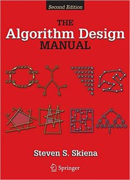

# علوم کامپیوتر رو خودآموز یاد بگیر

> This document is a persian(farsi) translation of TeachYourselfCS, written by [Ozan Onay](https://twitter.com/oznova_) and [Myles Byrne](https://twitter.com/quackingduck). For more information about this translation, please refer to [the end of this document](#translator).

> برای اطلاعات بیشتر در مورد ترجمه به [پایین فایل](#translator) مراجعه کنید.

نکته: این راهنما اردیبهشت ۱۳۹۹ دوباره نوشته شد. برای نسخه قبلی(سال 2016) [اینجا](https://teachyourselfcs.com/2016/) کلیک کنید.

اگر شما یک مهندس نرم افزار خود آموز یا با مدرک دوره های بوت کمپ هستید، یاد گرفتن علوم کامپیوتر را به خودتان مدیون هستید. خوشبختانه، میتوانید یک مدرک علوم کامپیوتر معتبر جهانی بدون سال ها درس خواندن و با هزینه کم دریافت کنید  :money_with_wings:.

منابع زیادی وجود دارد اما برخی از آنها از بقیه بهتر هستند. شما نیازی به یک لیست دویست تایی از پکیج های آموزشی ندارید. فقط کافیه که به این سوالات جواب بدید:

- شما باید **چه چیز هایی** را یاد بگیرید و چرا؟
- **بهترین کتاب یا دوره ویدئویی** برای هر کدام از آن موضوع ها چیست؟

## خلاصه متن (برای تنبل ها😉)

همه ی ۹ موضوع زیر را به ترتیب جدولی که آورده شده یاد بگیرید، میتوانید از کتاب ها یا ویدیو های آورده شده استفاده کنید، ولی بهتر است هم کتاب و هم ویدیو را دنبال کنید. برای یادگیری هر موضوع، ۱۰۰ تا ۲۰۰ ساعت وقت بگذارید و دوباره به علاقه و شغلی که می خواهید انتخاب کنید، فکر کنید :rocket:. 

|موضوع|دلیل یادگیری|کتاب|ویدئو|
|------:|---------:|:---|:-----|
| **[برنامه نویسی](#programming)** | اون آدمی نباشید که مطالب را "کامل درک نمی کرد". | *Structure and Interpretation of Computer Programs* | Brian Harvey’s Berkeley CS 61A |
| **[معماری کامپیوتر](#architecture)** | اگه ذهنیت درست و محکمی در مورد اینکه یک کامپیوتر چگونه کار میکند نداشته باشید، همه کار های سطح بالاتر شکننده خواهند بود. | *Computer Systems: A Programmer's Perspective* | Berkeley CS 61C |
| **[الگوریتم و ساختمان داده](#algorithms)** | اگر ندانید که چگونه از ساختارهایی مثل استک، درخت، صف و گراف استفاده کنید، مشکلات چالشی، غیرقابل حل خواهند بود. | *The Algorithm Design Manual* | Steven Skiena’s lectures |
| **[ریاضی برای علوم کامپیوتر](#math)** | علوم کامپیوتر در واقع یک شاخه از ریاضیات کاربردی است، پس یادگیری ریاضی برای شما یک مزیت مهم محسوب میشود. | *Mathematics for Computer Science* | Tom Leighton’s MIT 6.042J |
| **[سیستم عامل ها](#operating-systems)** | اکثر کد هایی که شما می نویسید توسط سیستم عامل اجرا می شوند، پس شما باید بدانید آنها چگونه باهم ارتباط برقرار میکنند. | *operating systems : Three Easy Pieces* | Berkeley CS 162 |
| **[شبکه های کامپیوتری](#networking)** | معلوم شد که اینترنت نقش بزرگی بازی میکند: درک کنید چگونه کار میکند تا از پتانسیل های آن بهره ببرید. | *Computer Networking: A Top-Down Approach*|Stanford CS 144 |
| **[پایگاه های داده](#databases)** | داده ها در قلب مهم ترین برنامه ها قرار دارند، اما افراد کمی درک میکنند که پایگاه داده ها در واقع چگونه کار میکنند. | *Readings in Database Systems* | Joe Hellerstein’s Berkeley CS 186 |
| **[زبان ها و کامپایلر](#languages)** | اگر شما درک کنید که زبان ها و کامپایلر در واقع چطور کار میکنند، شما کد های بهتری مینویسید و زبان های جدید را ساده تر یاد میگیرید. | *Crafting Interpreters* | Alex Aiken’s course on edX |
| **[سیستم های توزیع شده](#distributed-systems)** | امروزه اکثر سیستم ها، سیستم های توزیع شده اند. | *Designing Data-Intensive Applications* by Martin Kleppmann | MIT 6.824 |

## هنوز خیلی زیاده ؟

اگر ایده یادگیری 9 موضوع در طی چند سال طاقت فرسا است، ما پیشنهاد میکینم فقط روی دو تا کتاب تمرکز کنید: *Computer Systems: A Programmer's Perspective* و *Designing Data-Intensive Applications*. بر اساس تجربه ما، این دو کتاب با صرف وقت کم، بازده بسیار بالایی دارند، مخصوصا برای مهندسان خودآموز و فارق التحصیلان دوره های بوت کمپ که به صورت گروهی روی پروژه ها کار میکنند. شما همچنین میتوانند به عنوان دروازه ی ورودی به سر فصل های بالا از این کتاب ها استفاده کنند.

## چرا علوم کامپیوتر یاد بگیریم؟

دو دسته مهندس نرم افزار وجود دارد: آنهایی که علوم کامپیوتر را آنقدر خوب درک میکنند که کار های چالشی و خلاقانه انجام دهند ,و آنهایی که مهندس نرم افزارند چون با چند ابزار سطح بالا آشنایی دارند. 

هر دو دسته خود را مهندس نرم افزار میدانند و هردو تمایل دارند در ابتدای کارشان حقوق یکسان دریافت کنند. ولی مهندسان دسته اول در طی زمان در پروژه هایی با درآمد بالاتر و رضایت بخش تر استخدام میشوند، خواه این کار ارزش تجاری داشته باشد یا همکاری در یک پروژه اوپن سورس باشد، چه رهبری فنی باشد چه مشارکت فردی سطح بالا در یک پروژه باشد.

مهندسان دسته اول، علوم کامپیوتر را عمیق یاد گرفته اند، چه از طرق یادگیری به شکل متعارف و چه از طریق یادگیری پیوسته در طی حرفه ی خود. مهندسان دسته دوم معمولا در سطح باقی میمانند و در یادگیری، عمیق نمی شوند، به جای یادگیری پایه های اساسی یک مبحث، به یادگیری ابزار ها و تکنولوژی های آن میپردازند، و فقط زمانی یک مهارت جدید یاد میگیرند که باد تکنولوژی از آن سمت شروع به وزیدن کند.

در حال حاضر، تعداد افرادی که وارد صنعت کامپیوتر میشوند به شکل چشمگیری در حال رشد است، در حالی که تعداد فارغ التحصیلان رشته علوم کامپیوتر تقریبا ثابت باقی مانده است. این تعداد زیاد مهندسان نوع 2 فرصت های شغلی آنها را کاهش داده و آنها را از داشتن شغل رضایت بخش در صنعت کامپیوتر باز می دارد. چه شما بخواهید از مهندسان نرم افزار نوع یک باشید، یا صرفا به دنبال امنیت شغلی باشید، یادگیری علوم کامپیوتر تنها راه قابل اعتماد و مناسب است.

## راهنما برای هر موضوع

### برنامه نویسی

اکثر دوره های علوم کامپیوتر در مقطع کارشناسی با "مقدمه ای" بر برنامه نویسی کامپیوتر آغاز میشوند. نسخه های خوب این دوره ها نه تنها منبع خوبی برای تازه کاران است، بلکه برای آنهایی که در ابتدای یادگیری شان مفاهیم و مدل های برنامه نویسی را یاد نگرفته اند هم مفید است.

پیشنهاد استاندارد ما برای یادگیری برنامه نویسی کامپیوتر کتاب کلاسیک *Structure and Interpretation of Computer Programs* است، که به صورت رایگان و آنلاین، هم به عنوان [کتاب](https://mitpress.mit.edu/sites/default/files/sicp/full-text/book/book.html)، و هم در قالب مجموعه [ویدیو های سخنرانی دانشگاه MIT](http://ocw.mit.edu/courses/electrical-engineering-and-computer-science/6-001-structure-and-interpretation-of-computer-programs-spring-2005/video-lectures/) در دسترس است. با اینکه ویدیو های دانشگاه MIT خیلی خوب هستند، پیشنهاد ما برای دوره ویدیویی در واقع [سخنرانی های SICP  برایان هاروی ](https://archive.org/details/ucberkeley-webcast-PL3E89002AA9B9879E?sort=titleSorter) است. این ویدیو ها بیشتر از سخنرانی های دانشگاه MIT ، دانش آموزان جدید را هدف گرفته است.

ما پیشنهاد میکنیم سه فصل اول کتاب "SICP" را بخوانید و تمرین های آن را انجام دهید. برای تمرین اضافه تر، مشکلات و مسائل کوچک برنامه نویسی مانند نمونه های موجود در سایت [exercism](http://exercism.io/) را حل کنید.

اولین بار که این راهنما در سال 2016 منتشر شد، یکی از سوالاتی که به طور متداول از ما پرسیده شد این بود که آیا ما دوره های 61A که دوباره توسط جان دنیرو تدریس شده است یا کتاب مربوطه یعنی *[Composing Programs](https://composingprograms.com/)* ، که یکی از کتاب های یادگیری SICP به طور سنتی است اما از زبان پایتون استفاده میکند را پیشنهاد میکنیم یا نه. به نظر ما منابع دنیرو هم خوب هستند و ممکن است خیلی از دانش آموزان آن را ترجیح دهند، اما ما همچنان سخنرانی های SICP، Scheme، و برایان هاروی را به عنوان اولین منابعی که باید امتحان کنید پیشنهاد میکنیم.

چرا؟ چون SICP توانایی منحصر به فردی در تغییر عقاید شما -لا اقل پتانسیل آن را دارد- درباره کامپیوتر ها و برنامه نویسی دارد. همه این را تجربه نمی کنند. بعضی ها از کتاب متنفر میشوند، و بعضی ها حتی از خواندن صفحات اولیه کتاب هم نمی گذرند. اما این کتاب دارای پتانسیل بالایی است و ارزش امتحان کردن را دارد.

اگر از SICP لذت نبردید، کتاب *Composing Programs* را امتحان کنید. اگر آن هم برای شما مناسب نبود، کتاب *[How to Design Programs](http://www.htdp.org/)* را امتحان کنید. اگر هیچ کدام آنها برای شما جواب نداد، احتمالا به این معنی است که شما باید برای مدتی روی موضوعات دیگری تمرکز کنید، و یکی دو سال دیگر دوباره به برنامه نویسی باز گردید.

در نهایت، برای روشن شدن موضوع: این راهنما برای کسانی که کاملا در برنامه نویسی تازه کارند ساخته نشده است. فرض ما این است که شما برنامه نویسی، شایسته ولی بدون پیش زمینه در علوم کامپیوتر هستید، و به دنبال پر کردن برخی خلاء ها در دانش خود هستید. در واقع دلیل اینکه ما بخشی با موضوع برنامه نویسی را در این راهنما قرار دادیم این بود که به شما یادآوری کنیم که ممکن است چیز های بیشتری برای یادگیری در این زمینه باشد. برای کسانی که تا به حال کد نزده اند، اما دوست دارند که یاد بگیرند، شما ممکن است راهنمایی مثل [این یکی](https://www.reddit.com/r/learnprogramming/wiki/faq#wiki_getting_started) را ترجیح دهید.

### معماری کامپیوتر

معماری کامپیوتر -گاهی اوقات به آن "سیستم های کامپیوتری" یا "سازماندهی کامپیوتری" نیز گفته میشود- قسمت مهمی از کامپیوتر است که کار محاسبات را انجام میدهد و وقتی زیر لایه نرم افزاری را نگاه میکنیم با آن مواجه میشویم. طبق تجربه ما، مهندسان نرم افزار خود آموز درباره این لایه اطلاعات بسیار کمی دارند.

کتاب مقدماتی مورد علاقه ما برای این موضوع، کتاب *[Computer Systems: A Programmer's Perspective](http://csapp.cs.cmu.edu/3e/home.html)* است، و یک دوره معمول برای یادگیری معماری کامپیوتر بر اساس این کتاب، [این دوره](https://csapp.cs.cmu.edu/3e/courses.html) است، بیشتر فصل های 1 تا 6 مد نظر ما است.

ما کتاب CS:APP را برای رویکرد عملی و بر پایه برنامه نویسی اش دوست داریم. اگرچه معماری کامپیوتر بزرگتر از مباحث بحث شده در کتاب است، با این وجود نقطه شروع بسیار خوبی برای کسانی است که میخواهند سیستم های کامپیوتری را درک کنند تا بتوانند *نرم افزار* های قابل اطمینان تر و کارآمد تر را سریع تر بنویسند.

برای کسانی که مقدمه ای ملایم تر، و تعادل بین مباحث نرم افزاری و سخت افزاری را بیشتر میپسندند، ما کتاب *The Elements of Computing Systems* را پیشنهاد میکنیم، این کتاب به "Nand2Tetris" نیز معروف است. این کتاب جاه طلبانه قصد دارد به شما درک منسجمی از اینکه چطور همه چیز در کامپیوتر ها کار میکند بدهد. هر فصل شامل ساختن قسمت کوچکی از یک سیستم است، از نوشتن گیت های منطقی ابتدایی در HDL، به وسیله سی پی یو و اسمبلر، تا نوشتن یک برنامه به اندازه بازی تتریس(Tetris).

ما پیشنهاد میکنیم که شش فصل اول کتاب را بخوانید و پروژه های مربوطه را انجام دهید. این درک شما را از رابطه بین معماری ماشین، و نرم افزاری که روی آن اجرا میشود بیشتر میکند.

نیمه ی ابتدایی کتاب (و همه ی پروژه ها)، به صورت رایگان در [وبسایت Nand2Tetris](http://www.nand2tetris.org/) در دسترس است. همچنین در قالب [دوره آموزشی ویدیویی در Coursera](https://www.coursera.org/learn/build-a-computer) نیز موجود است.

به دنبال سادگی و انسجام، Nand2Tetris عمق را کمتر در نظر میگیرد. به طور خاص، دو مفهوم مهم در معماری کامپیوتر های مدرن pipelining و memory hierarchy هستند، اما در متن کتاب به آنها پرداخته نشده است.

وقتی با محتوای کتاب Nand2Tetris احساس راحتی کردید، ما پیشنهاد می کنیم یا به کتاب CS:APP باز گردید، یا کتاب *[Computer Organization and Design](https://smile.amazon.com/Computer-Organization-Design-Fifth-Architecture/dp/0124077269)* از Patterson Hennessy را شروع کنید، یک کتاب بسیار عالی و کلاسیک. خواندن تمام بخش های کتاب ضرورتی ندارد، ما پیشنهاد میکنیم [دوره CS61C](https://inst.eecs.berkeley.edu/~cs61c/sp15/) دانشگاه برکلی را دنبال کنید مخصوصا دوره “Great Ideas in Computer Architecture”. سخنرانی ها و کار عملی به صورت آنلاین در دسترس است، و سخنرانی های قدیمی نیز [در آرشیو اینترنت](https://archive.org/details/ucberkeley-webcast-PL-XXv-cvA_iCl2-D-FS5mk0jFF6cYSJs_) موجودند.

> سخت افزار بستر است

– Mike Acton, Engine Director at Insomniac Games
([CPPCon ویدیوی صحبت های او در ](https://www.youtube.com/watch?v=rX0ItVEVjHc))

### الگوریتم و ساختار داده

ما با چندین دهه خرد مشترک موافقیم، که آشنایی با الگوریتم ها و ساختارهای داده متداول، یکی از جنبه هایی است که به شما کمک میکند علوم کامپیوتر را یاد بگیرید. همچنین این راه بسیار خوبی است تا به صورت عمومی توانایی حل مسئله را در خود تقویت کنید، که به شما در یادگیری هر موضوعی و در هر زمینه ای کمک میکند.

صد ها کتاب در این باره موجود است، اما کتاب مورد علاقه ما، کتاب *[The Algorithm Design Manual](https://smile.amazon.com/Algorithm-Design-Manual-Steven-Skiena/dp/1848000693/)* است که توسط استیون اسکینا نوشته شده است.به وضوح او عاشق حل کردن مسائل بر پایه الگوریتم است و معمولا در القای این حس علاقه به دانش آموزانش و خوانندگان کتابش موفق بوده است. دو کتاب دیگر که معمولا پیشنهاد می شود CLRS و Sedgewick است، از نظر ما، مطالب ارائه شده در این کتاب ها برای کسانی که کتاب ها را برای تقویت توانایی حل مسئله خود می خوانند کمی سنگین است.

برای کسانی که سخنرانی ویدیویی را ترجیح میدهند، [اسکینا به صورت آنلاین آن ها را در اختیار ما قرار داده](https://www.youtube.com/watch?v=A2bFN3MyNDA&list=PLOtl7M3yp-DX32N0fVIyvn7ipWKNGmwpp). ما همچنین دوره آموزشی Tim Roughgarden را دوست داریم، که در [Coursera](https://www.coursera.org/specializations/algorithms) و [اینجا](http://timroughgarden.org/videos.html) در دسترس است. مهم نیست شما استایل سخنرانی *اسکینا* رو ترجیح میدهید، یا *روگاردن* را، این کاملا یک موضوع شخصی است و به شما بستگی دارد. در واقع، جایگزین های خوب دیگری هم وجود دارد، پس اگر شما دوره ای را پیدا کردید که مناسب شما بود و به آن علاقه داشتید، ما شما را تشویق میکنیم که آن را دنبال کنید!

برای تمرین کردن، ترجیح این است که دانش آموزان مسائل موجود در [Leetcode](https://leetcode.com/) را حل کنند. در این سایت سوال ها و مسائل جالب با راه حل ها و بحث های مناسب با سوال، قرار داده شده است. حل کردن این سوال ها همچنین به شما کمک میکند خود را برای سوال هایی که معمولا در مصاحبه های فنی در شرکت های نرم افزاری پرسیده میشود، آماده کنید. ما پیشنهاد میکنیم حدود 100 تا مسئله تصادفی "leetcode" را به عنوان بخشی از پروسه یادگیری این مبحث، حل کنید.

نهایتا، راهنمای *[How to Solve It](https://smile.amazon.com/How-Solve-Mathematical-Princeton-Science/dp/069116407X/)* یک راهنمای عالی و عمومی برای حل مسئله است، هدف این راهنما حل مسائل ریاضی است اما شما میتوانید از آن برای حل مسائل کامپیوتری نیز استفاده کنید.

> من فقط یک روش دارم که به همه پیشنهاد میکنم - قبل از اینکه بنویسی فکر کن.

— Richard Hamming

### ریاضی برای علوم کامپیوتر

علوم کامپیوتر به نوعی یک شاخه رشد کرده و بزرگ شده از ریاضیات است. در حالی که بسیاری از مهندسان نرم افزار در تلاشند این موضوع را نادیده بگیرند، ما شما را ترغیب میکنیم به مطالعه و یادگیری مستقیم آن بپردازید. اگر ریاضی را خوب یاد بگیرید به شما برتری قابل توجهی نسبت به آنهایی که ریاضی نمیدانند میدهد.

مرتبط ترین حوزه ریاضیات به علوم کامپیوتر "ریاضیات گسسته" نام دارد، در اینجا "گسسته" مخالف "مداوم" یا "پیوسته" است و شامل مجموعه ای از موضوعات جذاب ریاضیات کاربردی بدون محاسبات است. با توجه به این تعریف مبهم، شما نمیتوانید *تمام* مباحث ریاضیات گسسته را یاد بگیرید و تمام آن را پوشش دهید. یک هدف واقع بینانه تر این است که شما تلاش کنید درک کاربردی از منطق، ترکیبات و احتمالات، تئوری مجموعه ها، تئوری نمودار ها، و کمی تئوری اعداد که برای مباحث رمزنگاری به شما اطلاعات کافی میدهد را فرا بگیرید. جبر خطی یک زمینه خوب برای یادگیری اضافه تر است، از آنجا که در مباحث گرافیک کامپیوتری و یادگیری ماشین بسیار اهمیت دارد.

نقطه آغازین پیشنهادی ما برای ریاضیات گسسته مجموعه [یادداشت های سخنرانی توسط László Lovász](http://www.cs.elte.hu/~lovasz/dmbook.ps) است. پروفسور Lovász محتوای خوب و قابل دسترس را فراهم کرده، که از بیشتر متون معمول، نقطه بهتری برای آغاز است.

برای مباحث پیشرفته تر ما یادداشت های سخنرانی یکی از دوره های دانشگاه MIT با نام *[ریاضیات برای علوم کامپیوتر](https://courses.csail.mit.edu/6.042/spring17/mcs.pdf)*(Mathematics for Computer Science) که به اندازه یک کتاب طولانی است را پیشنهاد میکنیم. ویدیو های سخنرانی این دوره نیز [به صورت رایگان](https://ocw.mit.edu/courses/electrical-engineering-and-computer-science/6-042j-mathematics-for-computer-science-fall-2010/video-lectures/) در دسترس است، و ویدیو های سخنرانی پیشنهادی ما برای ریاضیات گسسته است.

برای جبر خطی، ما پیشنهاد میکنیم با مجموعه ویدیویی [Essence of linear algebra](https://www.youtube.com/playlist?list=PLZHQObOWTQDPD3MizzM2xVFitgF8hE_ab) آغاز کنید، و در ادامه این [کتاب](https://www.amazon.com/Introduction-Linear-Algebra-Gilbert-Strang/dp/0980232775/) از Gilbert Strang را مطالعه کنید، و با این [سخنرانی ویدیویی](https://ocw.mit.edu/courses/mathematics/18-06-linear-algebra-spring-2010/video-lectures/) ادامه دهید.

> مردم باور ندارند که ریاضی ساده است، تنها بخاطر اینکه متوجه نیستند که زندگی چقدر پیچیده است.

— John von Neumann

### سیستم عامل ها

*[Operating System Concepts](https://www.amazon.com/dp/1118063333/)* ("کتاب دایناسوری") و *[Modern Operating Systems](https://www.amazon.com/dp/013359162X/)* کتاب های کلاسیک یادگیری سیستم عامل ها هستند. که به هر دوی آنها انتقادات بسیاری بخاطر مبهم بودن برای دانش آموزان وارد شده است.

*Operating Systems: Three Easy Pieces*(OSTEP) جایگزین خوبی برای این دو کتاب است که [به صورت رایگان و آنلاین](http://pages.cs.wisc.edu/~remzi/OSTEP/) در دسترس است. ما به طور خاص ساختار، و خوانا بودن کتاب را دوست داریم، و حس میکنیم که تمرینات آن ارزشمند و خوب هستند.

پس از *OSTEP* ، ما شما را تشویق می کنیم به وسیله کتاب هایی با استایل "{OS name} Internals" تصمیمات گرفته شده درباره طراحی در سیستم عامل های مختلف را بررسی کنید، کتاب هایی مانند *[Lion's commentary on Unix](https://www.amazon.com/Lions-Commentary-Unix-John/dp/1573980137/)* ، *[The Design and Implementation of the FreeBSD Operating System](https://www.amazon.com/Design-Implementation-FreeBSD-Operating-System/dp/0321968972/)* و *[Mac OS X Internals](https://www.amazon.com/Mac-OS-Internals-Systems-Approach/dp/0321278542/)* نمونه های خوبی هستند. برای سیستم عامل Linux، هم ما کتاب فوق العاده [Linux Kernel Development](https://www.amazon.com/Linux-Kernel-Development-Robert-Love/dp/0672329468) از رابرت لاو را پیشنهاد میدهیم.

یک راه عالی برای تثبیت مطالبی که از سیستم عامل ها یاد گرفته اید، خواندن کد یک کرنل کوچک و تلاش برای اضافه کردن قابلیت های جدید به آن است. انتخاب شما برای خواندن کد میتواند [xv6](https://pdos.csail.mit.edu/6.828/2016/xv6.html) باشد، یک پورت یونیکس ورژن 6 به ANSI،C و x86، که به عنوان یک دوره در دانشگاه MIT تدریس میشود. یکی از ضمیمه های کتاب OSTEP [آزمایشگاه های xv6](http://pages.cs.wisc.edu/~remzi/OSTEP/lab-projects-xv6.pdf) است، که پر از ایده های خوب برای انجام پروژه است.

### شبکه های کامپیوتری

از آنجایی که بیشتر مهندسی نرم افزار روی وب سرور و کلاینت ها است، یکی از زمینه های با ارزش در علوم کامپیوتر، شبکه های کامپیوتر است. دانش آموزان خودآموز ما که به طور دقیق و منظم شبکه را مطالعه کرده بودند، نهایتا توانستند مفاهیم، مقررات و پروتکل های شبکه که سال ها با آنها کار می کردند و آنها را احاطه کرده بودند را درک کنند.

کتاب مورد علاقه ما در این زمینه *[Computer Networking: A Top-Down Approach](https://smile.amazon.com/Computer-Networking-Top-Down-Approach-7th/dp/0133594149/)* است. پروژه های کوچک و تمارین در کتاب ارزش حل کردن را دارند، و ما به طور خاص "آزمایشگاه Wireshark" را دوست داریم، که [به طور آنلاین](http://www-net.cs.umass.edu/wireshark-labs/) در اختیار همگان قرار گرفته است.

برای کسانی که سخنرانی ویدیوی را ترجیح میدهند، ما [*Introduction to Computer Networking course*](https://www.youtube.com/playlist?list=PLvFG2xYBrYAQCyz4Wx3NPoYJOFjvU7g2Z) از Stanford را پیشنهاد میدهیم، که قبلا در بستر MOOC استنفورد یعنی Lagunita در دسترس بود، اما متاسفانه در حال حاضر در قالب یک پلی لیست غیر رسمی در یوتیوب در دسترس است.

> شما نمیتوانید به یک گوی کریستالی خیره شوید و آینده را در آن ببینید. آنچه اینترنت قرار است در آینده باشد آن چیزی است که جامعه از آن می سازد.

— Bob Kahn

### پایگاه داده

برای دانش آموزان خودآموز یادگیری سیستم پایگاه های داده کمی بیشتر از دیگر موضوعات کار میبرد. این یک زمینه مطالعاتی نسبتا جدید (پس از سال 1970)با انگیزه های تجاری قوی است. علاوه بر این، بسیاری از نویسندگان خوب کتاب های درسی ترجیح دادند که به یک شرکت پیوسته یا شرکت خود را تاسیس کنند و نویسندگی را رها کنند.

با شرایطی که شرح داده شد، ما خود آموزان را تشویق می کنیم از کتاب های درسی در این زمینه دوری کنند و با دوره پایگاه های داده بارکلی از Joe Hellerstein به نام [recordings of CS 186](https://www.youtube.com/user/CS186Berkeley/videos) یادگیری را شروع کنند، و پس از آن برای مطالب پیشرفته تر شروع به خواندن مقالات کنند.

یکی از مقالاتی که برای دانش آموزان تازه کار مناسب است “[Architecture of a Database System](http://db.cs.berkeley.edu/papers/fntdb07-architecture.pdf)” است، که به شما نمای سطح بالایی از چگونگی کار "سیستم های مدیریت روابط پایگاه داده"(RDBMS) را نشان میدهد. این می تواند برای شما پایه و زیرساخت یادگیری مباحث بعدی باشد.

*Readings in Database Systems* ، که با نام ["کتاب قرمز" پایگاه های داده](http://www.redbook.io/) شناخته میشود، مجموعه ای از مقالات است که توسط *پیتر بایلیس* ، *جو هلرستین* و *مایکل استون بریکر* تصحیح و منتشر شده است. برای کسانی که در مراحل بالاتر مباحث CS186 هستند، "کتاب قرمز" باید مرحله بعدی یادگیری برای شما باشد.

اگر شما تاکید دارید با یک کتاب سطح مقدماتی شروع کنید، ما کتاب *[Database Management Systems](https://smile.amazon.com/Database-Management-Systems-Raghu-Ramakrishnan/dp/0072465638/)* از Ramakrishnan و Gehrke را پیشنهاد میکنیم. برای دانش آموزان در سطوح بالاتر، کتاب کلاسیک *[Transaction Processing: Concepts and Techniques](https://www.amazon.com/Transaction-Processing-Concepts-Techniques-Management/dp/1558601902)* از جیم گری، ارزش خواندن را دارد، ولی ما پیشنهاد نمیکنیم این کتاب را به عنوان اولین منبع آموزشی خود انتخاب کنید.

نهایتا، مدل سازی داده یکی از مباحث پایگاه داده است که کمتر به آن پرداخته شده است. کتاب پیشنهادی ما در باره این مبحث  *[Data and Reality: A Timeless Perspective on Perceiving and Managing Information in Our Imprecise World](https://www.amazon.com/Data-Reality-Perspective-Perceiving-Information/dp/1935504215)* است.

### زبان ها و کامپایلر ها

بیشتر برنامه نویس ها زبان های برنامه نویسی را یاد می گیرند، در حالی که بیشتر دانشمندان کامپیوتر *درباره* زبان های برنامه نویسی مطالعه میکنند. این به دانشمندان کامپیوتر برتری متمایزی نسبت به برنامه نویس ها می دهد، حتی در دامنه برنامه نویسی! دانش آنها در مورد جنبه های مختلف این علم بیشتر است، آنها میتوانند عملکرد زبان های جدید را بهتر درک کنند و عمیق تر و سریع تر از کسانی که فقط یک زبان خاص را یاد گرفته اند، زبان جدید را یاد بگیرند.

کتاب مقدماتی پیشنهادی ما کتاب عالی *[Crafting Interpreters](https://craftinginterpreters.com/contents.html)* از *باب نیستروم*(Bob Nystrom) است، که به صورت آنلاین و رایگان در دسترس است. این کتاب به خوبی سازماندهی شده، سرگرم کننده است و برای کسانی که میخواهند زبانشان یا ابزار های زبانشان را درک کنند مناسب است. ما پیشنهاد می کنیم برای تمام مطالب در این کتاب وقت بزارید، تلاش برای هر یک از چالش ها علاقه شما به یادگیری را تثبیت میکند.

یک پیشنهاد سنتی تر *[Compilers: Principles, Techniques & Tools](https://smile.amazon.com/Compilers-Principles-Techniques-Tools-2nd/dp/0321486811)* است، که معمولا به آن "کتاب اژدها" میگویند. متاسفانه، این کتاب برای یادگیری فردی ساخته نشده است، بلکه برای معلمان ساخته شده تا بتوانند مطالب 1 یا 2 ترم دوره خود را از میان آن تامین کنند.

اگر شما کتاب اژدها را برای یادگیری انتخاب کرده اید، ضروری است که فقط مطالب مهم را انتخاب کنید، یا حتی بهتر از آن، از یک مربی کمک بگیرید. در واقع، اگر کتاب اژدها را انتخاب کرده اید، راه پیشنهادی ما برای استفاده از آن به عنوان یک منبع تکمیلی برای یک سری سخنرانی ویدیویی است. سخنرانی ها پیشنهادی ما ویدیو های [Alex Aiken در edX](https://www.edx.org/course/compilers) است.

> اون برنامه نویسی که فقط از کد های آماده استفاده میکند نباش. درعوض، ابزار هایی برای مصرف کنندگان و برنامه نویسان دیگر بساز. یک درس تاریخی از صنایع پارچه و فولاد: میخواهی ماشین ها و ابزار رو تولید کنی یا میخوای فقط از اون ابزار استفاده کنی ؟

— در ابتدای دوره کامپایلر خود Ras Bodik

### سیستم های توزیع شده

در حالی تعداد کامپیوتر ها در حال افزایش است، آنها در حال *گسترده* شدن نیز هستند. در حالیکه در گذشته کسب و کار ها سیستم های بزرگ و بزرگتری خریداری میکردند، امروزه معمول است که حتی برنامه های کوچک نیز روی چندین ماشین جداگانه اجرا شوند. Distributed systems is the study of how to reason about the trade-offs involved in doing so.

کتاب پیشنهادی ما برای یادگیری خودآموز کتاب *[Designing Data-Intensive Applications](https://smile.amazon.com/Designing-Data-Intensive-Applications-Reliable-Maintainable-ebook/dp/B06XPJML5D/)* از مارتین کلیپ من است. DDIA کتابی بسیار خواندنی است و برای کسانی که در حال یادگیری و تمرین هستند طراحى شده است، که در آن حفظ عمق و دقت رعایت شده است، و خیلی بهتر از کتاب های آموزشی سنتی و مرسوم در این زمینه است.

برای کسانی که کتاب مرسوم تری را ترجیح میدهند، یا کسانی که کتاب رایگان آنلاین را ترجیح میدهند، ما کتاب *[Distributed Systems, 3rd Edition](https://www.distributed-systems.net/index.php/books/ds3/)* از *Maarten van Steen* و *Andrew Tanenbaum* را پیشنهاد میکنیم.

برای کسانی که ویدیو را ترجیح میدهند، یک دوره آموزشی خوب آنلاین همراه با ویدیو دوره [MIT’s 6.824](https://www.youtube.com/watch?v=cQP8WApzIQQ&list=PLrw6a1wE39_tb2fErI4-WkMbsvGQk9_UB) است، یک دوره تکمیلی با تدریس *Robert Morris* [اینجا](https://pdos.csail.mit.edu/6.824/schedule.html) در دسترس است.

فرقی نمیکند کتاب را به عنوان منبع انتخاب کنید یا از منبع دیگری استفاده کنید، یادگیری سیستم های توزیع شده کاملا به خواندن مقالات مربوطه وابسته است. لیست خوبی از آنها [اینجاست](http://dsrg.pdos.csail.mit.edu/papers/) ، و ما شما را تشویق میکنیم فصل [Papers We Love](https://paperswelove.org/) خود را تهیه کنید. 

## سوالات متداول

#### مخاطبان این راهنما چه کسانی هستند؟

ما به یاد داریم که شما یک مهندس نرم افزار خود آموز، یا فارغ التحصیل بوت کمپ یا یک دانش آموز باهوش دوره دبیرستان، یا از دانش آموزان دانشکده هستید که میخواهند تحصیلات رسمی خود را با یادگیری مطالب اضافه تر به صورت خودآموز تکمیل کنند. این سوال که چه زمانی باید این ماجراجویی را آغاز کرد یک سوال شخصی است، اما بیشتر افراد ترجیح میدهند قبل از عمیق شدن در علوم کامپیوتر سابقه کار حرفه ای در این زمینه را داشته باشند. برای مثال، ما متوجه شدیم که اگر دانش آموزان به صورت حرفه ای با پایگاه داده کار کرده باشند *عاشق* یادگیری عمیق سیستم پایگاه داده میشوند، یا اگر آنها روی یکی دو تا پروژه وب کار کرده باشند علاقه زیادی به یادگیری شبکه های کامپیوتری پیدا میکنند.

#### درباره هوش مصنوعی/ گرافیک/ فلان موضوع مهم چطور؟

ما سعی کردیم لیست موضوعات علوم کامپیوتر مورد بحث در این راهنما را به موضوعاتی که فکر میکنیم *هر مهندس نرم افزار آموزش دیده ای* باید بداند محدود کنیم، صرف نظر از تخصص افراد و این صنعت، همینطور سعی کرده ایم روی سیستم ها تمرکز کنیم. طبق تجربه ما، این مباحث و موضوعات بیشترین بازده را برای اکثر مهندسان خودآموز یا فارغ التحصیلان دوره های بوت کمپ دارد، و زیرساخت محکم و خوبی را برای مطالعات بیشتر در این زمینه فراهم میکند. متعاقبا، شما در موقعیت بهتری قرار میگیرید، به گونه ای که میتوانید کتاب ها و راهنما های مختلف را خوانده و بدون راهنمایی و صرف وقت زیاد مباحث اصلی را یاد بگیرید. در اینجا نقاط شروع پیشنهادی ما برای چند "انتخاب" رایج آورده شده است:

- برای هوش مصنوعی: دوره [Berkeley’s intro to AI course](http://ai.berkeley.edu/) را با دیدن ویدیو ها و کامل کردن [پروژه پک من](http://ai.berkeley.edu/project_overview.html) یاد بگیرید. و کتاب پیشنهادی ما کتاب *Artificial Intelligence: A Modern Approach* از "راسل" و "نورویگ" است.
- برای یادگیری ماشین: دوره coursera از Andrew Ng را انجام دهید. صبور باشید، و مطمئن باشید که قبل از یادگیری سرفصل های جذاب و توی چشم مثل deep learning ابتدا اساس آن را یاد بگیرید.
- برای گرافیک کامپیوتر: [Berkeley’s CS 184](http://inst.eecs.berkeley.edu/~cs184/fa12/onlinelectures.html) را به عنوان دوره آموزشی در نظر بگیرید، و میتوانید از کتاب [Computer Graphics: Principles and Practice](https://www.amazon.com/Computer-Graphics-Principles-Practice-3rd/dp/0321399528) استفاده کنید.

#### یادگیری موارد پیشنهاد شده چقدر سخت است؟
در واقع، همه این مباحث مقداری با هم اشتراک دارند، و به صورت چرخشی به یکدیگر باز میگردند. برای مثال رابطه بین ریاضیات گسسته و الگوریتم: یادگیری ریاضی به شما کمک میکند الگوریتم ها را با عمق بیشتری درک کنید، ولی اگر اول الگوریتم را یاد بگیرید به شما انگیزه می دهد و زمینه را برای یادگیری ریاضیات گسسته فراهم میکند. در حالت ایده آل در طول زندگی حرفه ای چندین و چند بار این مباحث را خواهید دید.

ترتیب پیشنهادی ما برای یادگیری مباحث فقط به شما کمک میکند *شروع کنید*... اگر ترتیب بهتری برای یادگیری پیدا کردید، از آن استفاده کنید. از نظر ما مهم ترین "پیش نیاز ها": یادگیری معماری کامپیوتر قبل از یادگیری سیستم عامل و پایگاه داده است، و یادگیری شبکه و سیستم عامل قبل از یادگیری سیستم های توزیع شده.

#### چطور این راهنما رو با برنامه های درسی جامعه اوپن سورس یا freeCodeCamp مقایسه میکنید؟

وقتی این راهنما برای اولین بار در سال 2016 نوشته شد، [راهنمای OSS](https://github.com/open-source-society/computer-science)، مباحث بسیار زیادی را در خود جای داده بود، و منابع کمی را برای آنها پیشنهاد کره بود، و هیچ دلیل منطقی یا راهنمایی در مورد اینکه چرا این دوره ها برای یادگیری مناسبند یا چه جنبه هایی از کدام دوره مهم است اراعه نکرده بود. ما تلاش کرده ایم که لیست موضوعات را به لیست موضوعاتی که شما به عنوان یک مهندس نرم افزار بدون در نظر گرفتن تخصص تان *واقعا باید بدانید* محدود کنیم، و به شما کمک کنیم درک کنید که چرا هر کدام از آنها در این لیست وجود دارند و چرا برای شما مناسبند. در طی سال ها راهنمای OSS بهتر شد، ولی ما همچنان بر این باور هستیم که راهنمای ما مسیر منسجم تر و واضح تری را به شما نشان میدهد.

تمرکز freeCodeCamp بیشتر بر برنامه نویسی است و نه علوم کامپیوتر. برای اینکه بدانید چرا میخواهید علوم کامپیوتر را یاد بگیرید، به [بالا](#why) بروید. اگر تازه شروع به برنامه نویسی کرده اید، پیشنهاد میکنیم یادگیری تان را اولویت بندی کنید، و بعد از یکی دو سال به این راهنما برگردید.

#### راجع به فلان زبان چطور؟

یادگیری یک زبان برنامه نویسی خاص کاملا با یادگیری یک حوزه علوم کامپیوتر متفاوت است - یادگیری یک زبان خیلی *ساده تر* و *کم ارزش تر* است. اگر شما در حال حاضر چند زبان برنامه نویسی بلد هستید، ما قویا پیشنهاد میکنیم راهنمای ما را دنبال کنید و با تحصیل کامل مفاهیم زبان خلاء های دانش خود را پر کنید، یا یادگیری آن را به زمان دیگری موکول کنید. اگر شما برنامه نویسی را خوب یاد گرفته باشید (مانند یادگیری از طریق *Structure and Interpretation of Computer Programs*)، مخصوصا اگر شما کامپایلر ها را یاد گرفته باشید، برای شما تقریبا کمی بیشتر از یک آخر هفته طول میکشد تا موارد مهم یک زبان جدید را یاد بگیرید، پس از آن شما میتوانید درباره ی کتابخانه ها/ ابزار ها/ محیط در بازار کار آن زبان یاد بگیرید.

#### راجع به فلان تکنولوژی که خیلی معروف شده چطور؟

هیچ تکنولوژی واحدی آنقدر مهم نیست که برای یادگیری استفاده از آن بخش اصلی تحصیل شما به آن اختصاص داده شود. با این حال این خیلی خوب است که شما برای یادگیری آن تکنولوژی مشتاق هستید. راهکار این است که به مسئله برعکس نگاه کنیم، از سمت آن تکنولوژی به زیر ساخت ها و مفهوم اصلی آن نگاه کنیم و قبل از اینکه ببینیم چطور تکنولوژی مدرن ما در سطح بالا کار میکند آن را عمیق یاد بگیریم.

#### چرا هنوز کتاب SICP رو پیشنهاد میکنم؟

ببین، فقط امتحانش کن. برخی SICP را حیرت آور میدانند، کتاب هایی با شخصیتی همچون شخصیت این کتاب بسیار کم هستند. اگر آن را دوست نداشتید، همیشه می توانید چیز دیگری را امتحان کنید و شاید بعدا دوباره به SICP برگردید.

#### چرا هنوز کتاب Dragon رو پیشنهاد میکنم؟

کتاب Dragon همچنان کامل ترین منبع برای یادگیری کامپایلر ها است. معمولا برای تاکید بر موضوعاتی که امروزه پوشش دادن آنها کمتر مد است مثل parsing اسمش بد در رفته است.مسئله این است که این کتاب هرگز تهیه نشد تا جلد به جلد مطالعه شود بلکه فقط برای دادن مطالب کافی به یک مدرس برای درست کردن یه دوره ساخته شد. به این ترتیب یک خودآموز میتواند راه خود را برای یادگیری مطالب کتاب پیدا کند، یا بهتر است از سرفصل های پیشنهاد شده مدرسان دوره های عمومی استفاده کند.

#### چگونه میتونم کتاب ها را ارزان تهیه کنم؟

خیلی از کتاب هایی که در این مطلب معرفی شده، با تشکر از سخاوتمندی نویسنده هاشون، بصورت آنلاین و رایگان موجود هستند. آن کتابهایی هم که رایگان نیستند، پیشنهاد میکنیم ویرایش های قدیمی آنها را تهیه کنید. یک قانون نانوشته هست که میگه، اگه ویرایش های زیادی از یه کتاب داشته باشیم، یه نسخه قدیمی تر هم از اون کتاب کافی هست. هیچوقت یه نسخه جدید از کتاب ۱۰ برابر نسخه قدیمی تر بهتر نیست، فقط قیمت ها متفاوت است!

#### سازنده این راهنما کیست؟

این راهنما درابتدا توسط [Oz Nova](https://twitter.com/oznova_) و [Myles Byrne](https://twitter.com/quackingduck) نوشته شده بود که سال ۱۳۹۹ توسط Oz بروز شد. این مطالب بر اساس تجربه ایشان در زمینه تدریس مبانی علوم کامپیوتر به بیش از ۱۰۰۰ خودآموز و دانشجوی مهندسی در سانفرانسیسکو بصورت آنلاین است. از همه دانشجوهایی که برای کامل کردن منابع خودآموزی کمک کردن سپاسگزاری میکنیم.

### مترجم این راهنما کیست؟
سلام من <a href="https://github.com/F4R4N" target="_blank">فاران تقوی</a> هستم برنامه نویس خودآموز!
اگر اشکالی در این ترجمه پیدا کردید حتما در <a href="https://github.com/F4R4N/TeachYourselfCS-FA" target="_blank">گیت هاب</a> پول ریکوئست بزنید.تا اشکالات این راهنما را برطرف کنیم.
از آنجایی که این مقاله می تواند به بسیاری از علاقه مندان کمک کند،تلاش میکنم تا جای ممکن اشکالات آن را برطرف کنم و هرگونه کمکی باعث خوشحالی من است.

